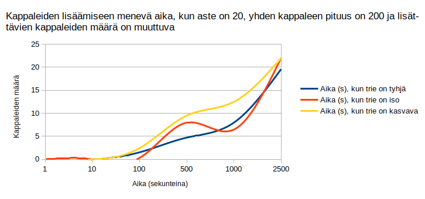

# Testausdokumentti

## Mitä on testattu?
### Yksikkötestaus

#### Yksikkötestauksen testikattavuusraportti

Yksikkötestauksen ulkopuolelle on jätetty käyttöliittymän komponentit eli käyttöliittyma.py ja kaikki eri näkymät eli nakyma.py, aloitusnakyma.py, kappalenakyma.py ja opetusnakyma.py sekä sovelluksen käynnistykseen tarkoitettu sovellus.py-tiedosto ja tests-hakemisto, jossa on kaikki testit.
Toisin sanoen muuten src-hakemiston muu koodi on yksikkötestattu.

#### TrieRakenne-luokka

TrieRakenne-luokkaa on testattu siten, että voidaan olla varmistuneita siitä, että sen metodit toimivat niin kuin pitää. 
Testimetodi test_etsi_sekvenssin_seuraajat_loytaa_oikeat_seuraajat testaa sitä, että etsi_sekvenssin_seuraajat-metodi toimii oikein. Samalla tulee testattua, että lisaa_kappale-metodi lisää trieen oikean pituisia sekvenssejä.

#### Kappaleen generointi

Kappaleen generointia on testattu muum muassa siten, että kappaletta ei generoida virheellisillä parametreilla, kappale koostuu oikean mittaisista opetusdatan sekvensseistä ja lisäksi tilanteita, jossa kappaleen generointi epäonnistuu. Lisäksi on testattu funktiota, joka muuttaa kappaleen ja edellisten sävelien/nuottien arvot oikein, että arvot todella ovat oikeat.

#### Json-funktiot

Json-funktioita on testattu siten, että on varmistettu, että ne osaavat hakea oikean sisällön data.json-tiedostosta, ja että ne tallentavat oikein uuden sisällön samaan tiedostoon. 

#### Muut funktiot

Muut funktiot, kuten lisaa_opetusdataan_kappale, syotetyn_kappaleen_tarkistus ja soita_kappale, on testattu suurimmaksi osaksi siten, että on tutkittu niiden palautuksia, ja että ne palauttavat tietyn jutun tietyn toimenpiteen seurauksena.

#### Muut luokat

Luokat Solmu, Arpoja ja Soittaja on testattu vain siten, että on tarkistettu, että niiden konstruktori konstruktroi ne oikein, ja että niiden metodi toimii oikein.

### Suorituskykytestaus

Suorituskykytestauksessa on testattu kappaleen generointia isolla trie-rakenteella ja kappaleiden lisäämistä trie-rakenteeseen, kun kappaleita on paljon ja ne ovat pitkiä.

#### Kappaleen generoinnin suorituskykytestaus

Testasin, miten kappaleen generoiminen vaihtelee generoidessa sävelsekvensseistä koostuvasta triestä ja nuoteista koostuvasta triestä. Valitsin asteeksi 20 ja generoitavan kappaleen pituudeksi 60. Opetusdata koostui sadasta sadan sävelen/nuotin mittaisesta kappaleesta. Generointia toistettiin joka kierroksella eri määrä.

Lopputulemana oli, että nuottisekvensseistä koostuvan trien avulla on vähän nopeampaa generoida uusia kappaleita.

Toinen asia, jota testasin, oli se, miten aste vaikuttaa generoinnin nopeuteen sävelsekvensseistä koostuvan trien ja nuoteista koostuvan trien välillä.
Joka kierroksella generoitiin yksi 200 sävelen/nuotin mittainen kappale. Aste kasvoi joka kierros.

Lopputulemana oli, että suurimmaksi osaksi nuottisekvensseistä koostuvan trien avulla oli hiukan nopeampaa generoida uusi kappale.

#### Kappaleen lisäämisen suorituskykytestaus

Testasin, miten trie-rakenteen koko vaikuttaa siihen, miten nopeaa on lisätä lisää kappaleita trieen. Kokeilin kappaleiden lisäämistä trieen, joka on tyhjä silloin kun lisäys tehdään, toiseen trieen, johon oli jo valmiiksi lisätty 1000 kappaletta 200:n sävelen mittaista kappaletta asteella 20, ja kolmanteen trieen, jonka koko kasvoi joka kierroksella.

Toinen asia, jota testasin kappaleen lisäämisessä, oli se, miten aste vaikuttaa lisäämiseen. Kokeilin lisäämistä taas kolmeen eri trieen: tyhjään, isoon ja kasvavaan trieen. Isoon trieen lisätään joka kierroksen alussa 100 kappaletta 505:n sävelen mittaista sekvenssiä sen kierroksen asteella.

Lopputulema on se, että mitä suurempi aste ja trie, sitä kauemmin menee lisätä uusia sekvenssejä trieen.
Lisäksi kasvava trie ei loppujen lopuksi varmaan ollut hyvä tähän testiin, koska joka kierroksella siihen lisättiin eripituisia sekvenssejä.

Kolmas testaamani asia oli verrata sävelsekvenssien lisäämistä trieen ja nuottisekvenssien lisäämistä toiseen trieen. Molempiin triieihin lisättiin 100 kappaletta asteella 20, ja kappaleiden pituus vaihteli joka kierroksella.

Lopputulemana oli se, että sävelsekvenssejä on nopeampaa lisätä kuin nuottisekvenssejä. Sovelluksessa on käytössä kolme oktaavia, seitsemän säveltä, joista kaikki voivat olla ylennettyjä, alennettuja tai vain sellaisenaan. Näin ollen sävelsekvenseissä voi koostua 63 eri sävelestä, kun taas nuottisekvenssi voi koostua vain seitsemästä eri nuotista, koska sovelluksessa on käytössä vain seitsemän eri nuottia.
